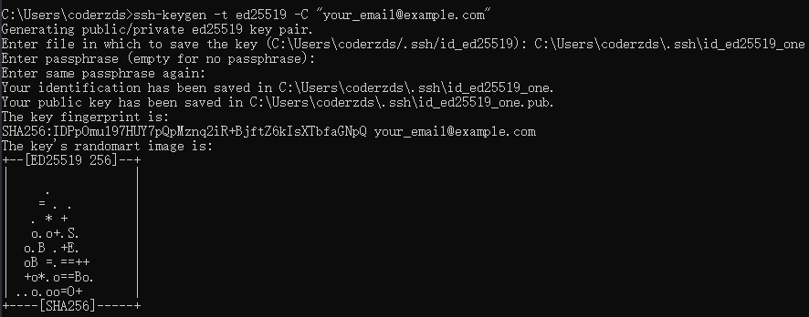
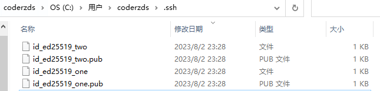

# win下管理多个github账号

### 1、本地生成密钥 [官方文档](https://docs.github.com/en/authentication/connecting-to-github-with-ssh/generating-a-new-ssh-key-and-adding-it-to-the-ssh-agent)，并在github设置中配置

```bash
ssh-keygen -t ed25519 -C "your_email@example.com"
```

这个步骤会检测你在`~/.ssh`下是否有`id_ed25519`文件，这里默认生成的是`id_ed25519`,  这一步我们直接输入绝对地址，比如`C:\Users\coderzds\.ssh\id_ed25519_one`



### 2、重复以上步骤， `这里我以两个为例`，得到下面这四个文件




### 3、在`~/.ssh`文件夹下建一个`config`文件（`若无`）

```bash
# 账号1
Host one #这里的host名字随便起
HostName github.com
User git
IdentityFile ~/.ssh/id_ed25519_one
# 账号2
Host two
HostName github.com
User git
IdentityFile ~/.ssh/id_ed25519_two
```

### 4、拉取项目后，在项目内部配置远程地址，以确保本地与远端建立联系

```bash
# 账号1下的项目地址
git remote set-url origin git@one:username/repositories.git 

# 账号2下的项目地址
git remote set-url origin git@two:username/repositories.git 

# 只要确保git@后面的host和第三步中的一致就可以
```

